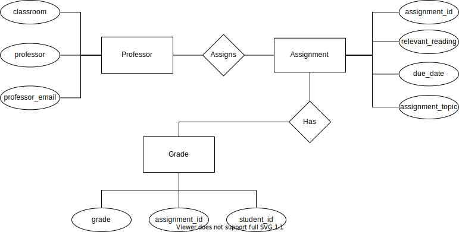

# Data Normalization and Entity-Relationship Diagramming

## Table containing the original data set 

| assignment_id | student_id | due_date | professor | assignment_topic                | classroom | grade | relevant_reading    | professor_email  |
| :------------ | :--------- | :------- | :-------- | :------------------------------ | :-------- | :---- | :------------------ | :--------------- |
| 1             | 1          | 23.02.18 | Bloomberg | Data normalization              | WWH 101   | 80    | Deumlich Chapter 3  | bloo@foo.edu     |
| 2             | 1          | 18.11.18 | Engel     | Single table queries            | 60FA 314  | 25    | Dümmlers Chapter 11 | d.e.1234@foo.edu |
| 1             | 4          | 23.02.18 | Bloomberg | Data normalization              | WWH 101   | 75    | Deumlich Chapter 3  | bloo@foo.edu     |
| 5             | 2          | 05.05.18 | Engel     | Python and pandas               | 60FA 314  | 92    | Dümmlers Chapter 14 | d.e.1234@foo.edu |
| 4             | 2          | 04.07.18 | Clayton   | Spreadsheet aggregate functions | WWH 201   | 65    | Zehnder Page 87     | j.c.3@foo.edu    |
| ...           | ...        | ...      | ...       | ...                             | ...       | ..  .   | ...                 | ...              |

## Reasons why this table is not in Fourth Normal Form (4NF)
  
The qualifications for a table/database to be in Fourth Normal Form is that it must satisfy second normal form, third normal form, and Boyce-Codd normal form. In addition, it must not contain more than one independent multi-valued fact about an entity. The original dataset violates both of these  requirements. In fact, this original dataset does not satisfy second normal form because it contains non-key fields that do not provide any relevant information about the primary key. If we choose assignment_id to be the primary key for this table, then the column professor_email provides facts about an unrelated entity. 

## Tables containing the 4NF compliant version of the data set

### Professor Table

| professor | classroom | professor_email |
| :------------ | :--------- | :------- |
| Bloomberg | WWH 101 | bloo@foo.edu |
| Engel | 60 FA 314 | d.e.1234@foo.edu |
| Clayton | WWH 201 | j.c.3@foo.edu | 

### Assignment Table 

| assignment_id | due_date | assignment_topic | relevant_reading |
| :------------ | :--------- | :------- | :-------- |
| 1 | 23.02.18 | Data Normalization | Deumlich Chapter 3 |
| 2 | 18.11.18 | Single table queries | Dümmlers Chapter 11 |
| 5 | 05.05.18 | Python and pandas | Dümmlers Chapter 14 |
| 4 | 04.07.18 | Spreadsheet aggregate functions | Zehnder Page 87 | 

### Assignment Grades Table

| assignment_id | student_id | grade |
| :--------- | :-------------| :---- |
| 1 | 1 | 80 |
| 2 | 1 | 25 |
| 1 | 4 | 75 |
| 5 | 2 | 92 |
| 4 | 2 | 65 |

### Assignment Professors Table

| assignment_id | professor |
| :-------------| :-------- |
| 1 | Bloomberg |
| 2 | Engel |
| 5 | Engel |
| 4 | Clayton | 

## Entity-Relationship Diagram of this data set

## Description of my changes

The biggest change I made to this dataset was to convert it from one table into four, smaller tables that adhere to fourth normal form guidelines. This way, the singular table that suffers from multivalued dependencies is broken into four tables that do not violate fourth normal form requirements. For instance, in the Professor table, the primary key in this table is the professor (the name). All of the other values in this table are directly related or relevant to each individual professor, such as the professor's email and classroom. In the Assignment Professor table, there are only two columns: assignment_id and professor. The assignment_id is the primary key while the professor acts a foreign key to the Professor table. This minimizes the redundancy that existed in the original dataset. 