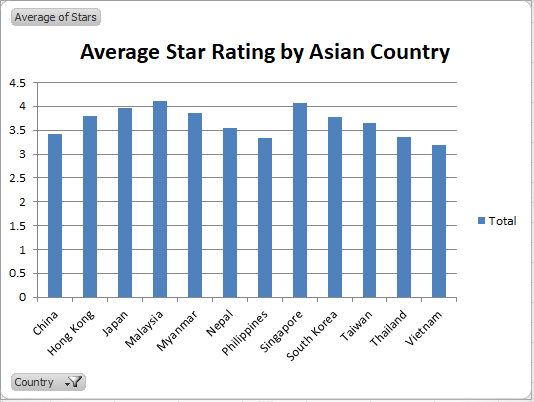

# Spreadsheet Analysis

## Data Set Details
I chose to complete my Spreadsheets workshop assignment on [Ramen Ratings](https://www.kaggle.com/residentmario/ramen-ratings) out of my love for deliciious ramen. Ramen is a Japanese comfort food that is popular in all parts, and I wanted to make analysis and see any interesting statistics about this. I found this data set on [Kaggle](https://kaggle.com), and the data was stored as a .csv file. When the data set was initially downloaded, the first 14 lines of raw data looked like this: 
Review # | Brand | Variety | Style | Country | Stars | Top Ten
---------| ------| --------| ------| --------| ------| -------
2580 | New Touch | T's Restaurant Tantanmen | Cup | Japan | 3.75 | 
2579 | Just Way | Noodles Spicy Hot Sesame Spicy Hot Sesame Guan-miao Noodles | Pack | Taiwan | 1 |
2578 | Nissin | Cup Noodles Chicken Vegetable | Cup | USA | 2.25 |
2577 | Wei Lih | GGE Ramen Snack Tomato Flavor | Pack | Taiwan | 2.75 |
2576 | Ching's Secret | Singapore Curry | Pack | India | 3.75 | 
2575 | Samyang Foods | Kimchi song Song Ramen | Pack | South Korea | 4.75 | 
2574 | Acecook | Spice Deli Tantan Men With Cilantro | Cup | Japan | 4 | 
2573 | Ikeda Shoku | Nabeyaki Kitsune Udon | Tray | Japan | 3.75 | 
2572 | Ripe'n'Dry | Hokkaido Soy Sauce Ramen | Pack | Japan | 0.25 |
2571 | KOKA | The Original Spicy Stir-Fried Noodles | Pack | Singapore | 2.5 | 
2570 | Tao Kae Noi | Creamy tom Yum Kung Flavour | Pack | Thailand | 5 | 
2569 | Yamachan | Yokohama Tonkotsu Shoyu | Pack | USA | 5 | 
2568 | Nongshim | Mr. Bibim Stir-Fried Kimchi Flavor | Pack | South Korea | 4.25 |
2567 | Nissin | Deka Buto Kimchi Pork Flavor | Bowl | Japan | 4.5 |

The most blatant problem with the original data set was that there were a handful of records with "Unrated" as a star rating. Because these ramen products had missing star ratings, I decided it would be best to completely remove these records from the data set. Adding on, there was another problem with the column labeled "Top Ten". This column would display the ramen product that was considered one of the Top Tens for a given year. However, because there were 2580 reviews in this data set, only around 50 reviews would have a value for the "Top Ten" column. As a result, all of the other ~2530 products had its field for Top Ten blank. As a result, I decided to completely leave out all records that were considered one of the Top Ten in a given year. This was achieved by reading in the csv file line by line. From there, I would split each line by comma and it would result in an array with 7 elements. Because the Top Ten column was the seventh column in the data set, I checked whether the Top Ten field for each record was empty or not empty. If it was empty, I would add this particular record to the clean data set. In addition, one minor problem with the original data set was the encoding. When reading in the csv, it was necessary to specify the character encoding to utf-8. When the character encoding was not declared, Python would have trouble reading in some lines of the data. 

## Data Set Analysis 

##### Aggregate Statistics

Sum of Star Ratings: 9198.6. This statistic was calculated with the formula "=SUM(F2:F2535)"\
Max Star Rating: 5. With over 2500 records in this data set, it was no surprise that at least one ramen product has a perfect star rating. This statistic was calculated with the formula "=MAX(F2:F2535)".\
Min Star Rating: 0. Similarly to the max star rating, it was no surprise that the minimum star rating for this dataset was actually a 0 star rating. This statistic was calculated with the formula "=MIN(F2:F2535)"\
Average Star Rating of All Products: 3.6343. I thought this would be an interesting statistic to find. Because the middle of 0 and 5 is 2.5, it would make sense for the average ramen rating to fall somewhere close to 2.5, but it was in fact ~3.6 which was a lot higher than I had initially expected. This statistic was calculated with the formula "=AVERAGE(F2:F2535)"

##### Aggregate Statistics with Conditions

Average Star Rating for Japanese Ramen Products: 3.9659. I wanted to calculate this statistic specifically because ramen originates from Japan. It has been said that Japanese ramen is the best tasting ramen, so I wanted to put this to the test with actual data evidence. Because I had earlier calculated the average ramen ratings of all products to be around 3.6, it was no surprise that the average Japanese ramen product star rating was higher. This statistic was calculated with the formula "=AVERAGEIF(E2:E2535, "Japan", F2:F2535)"\
Number of Japanese Ramen Products with 5 Star Rating: 69. Again, this was similar to the above statistic about average Japanese ramen ratings. I was curious to see how many 5 star Japanese ramen products were in this data set. This statistic was calculated with the formula "=COUNTIFS(E2:E2535, "Japan", F2:F2535, 5)"\
Average Star Rating for USA Bowl Ramen: 3.4. I was interested in American bowl ramen because this type of ramen is what I consume the most. To my dismay, the ratings for USA bowl ramen was a bit lower than the average. Although this was to be a bit expected, I was still saddened to see this. This statistic was calculated with the formula "=AVERAGEIFS(F2:F2535, D2:D2535, "Bowl", E2:E2535, "USA")"\
Number of East Asian Ramen Products: 1170. Because most of the East Asian countries influence each other in terms of culture and food, I was curious to see the number of total East Asian ramen products. The total turned out to be 1170, which is almost half of all records in this data set. This was not very surprising to me because ramen is an immensely popular comfort food especially in Asia. This statistic was calculated with the formula "=SUM(COUNTIF(E2:E2535, {"Japan", "Taiwan", "Hong Kong", "South Korea", "China"}))"

##### Pivot Table and Chart for Visualization

I used Microsoft Excel's built-in Pivot Table function to create a Pivot Table with only the columns corresponding to Country and Star Rating. From there, I filtered only the countries in Asia and calculated the Average Star Rating of all ramen products by country. The following pivot table looked as follows:
Row Labels | Average of Stars
-----------|-----------------
China | 3.7967
Hong Kong | 3.7966
Japan | 3.9659
Malaysia | 4.1201
Myanmar | 3.8653
Nepal | 3.5535
Philippines | 3.3297
Singapore | 4.0661
South Korea | 3.7698
Taiwan | 3.6533
Thailand | 3.3590
Vietnam | 3.1879
Grand Total | 3.7168

Using this Pivot Table, I was able to use Excel's built-in Pivot Chart function to create a Clustered Column chart. 

From the visualization, we can see that most of the Asian countries had their average ramen ratings higher than the global average of 3.63. From the pivot table, we saw that the total average of all Asian countries was 3.7168, which comes as no surprise because ramen has the most influence in the East. 